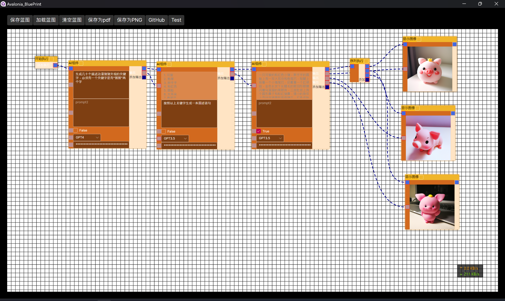
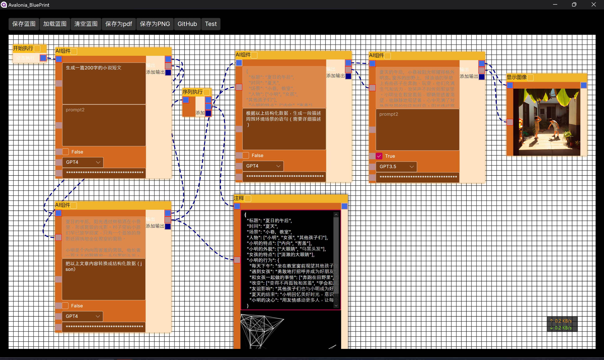
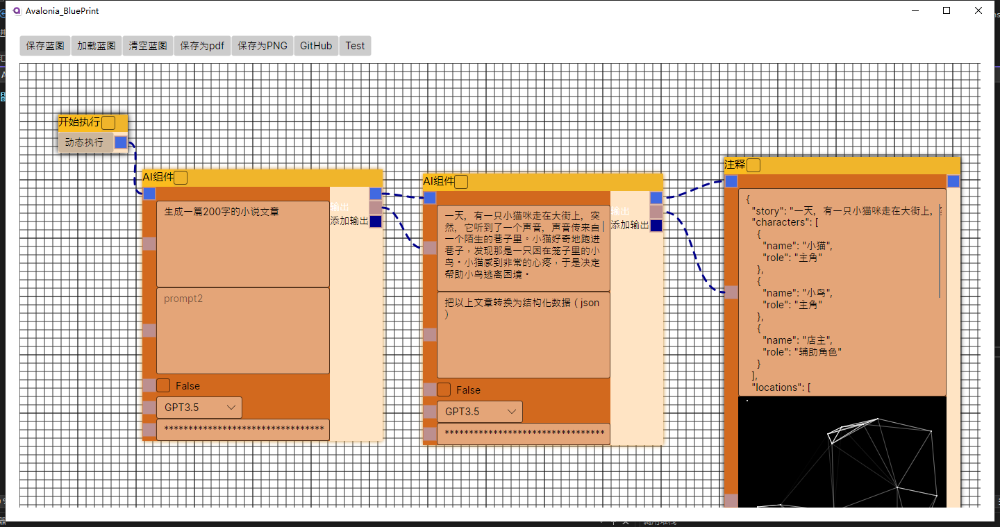
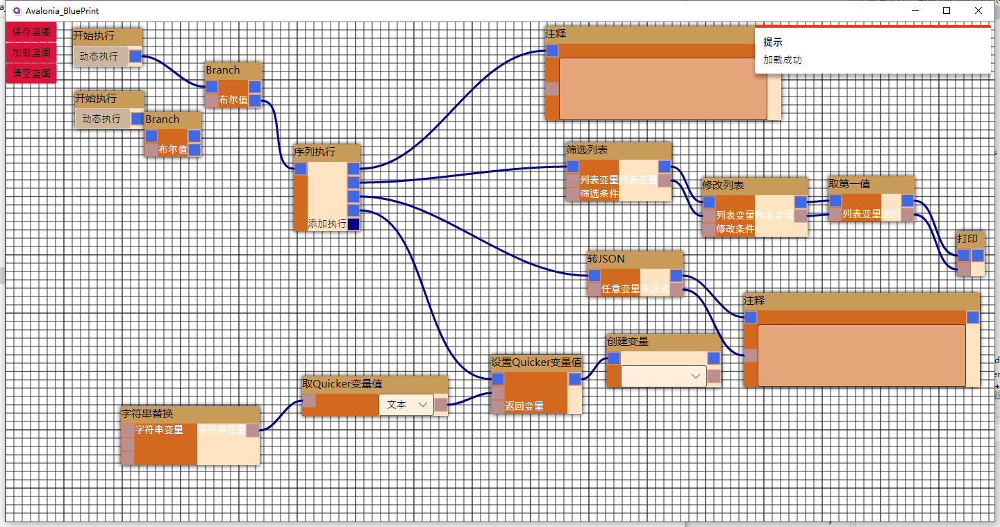
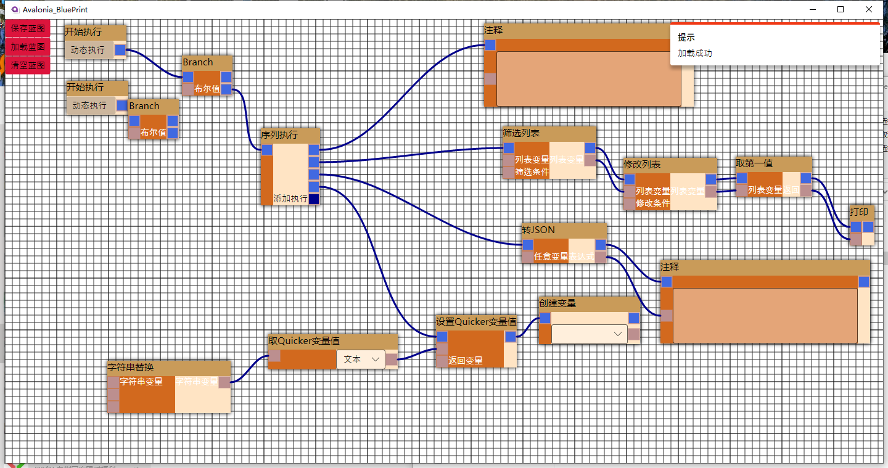

# Avalonia_BluePrint

可视化节点编辑器

> ###代办  
- [x] 三态折叠 √  
- [x] 滚轮缩放 √
- [x] 序列化反序列化 √
- [x] 右键菜单 √
- [x] 支持aot √
- [x] 鼠标拖动蓝图 √ 
- [x] 蚂蚁线 √  
- [ ] 多选+操作  
- [ ] 电路线  
- [ ] 划块注释  
- [ ] 划块合并  
- [ ] ui主题  

## 使用
### 安装包：HMBB.BluePrint.Node.Common

    在ui上配置引用
    xmlns:bp="using:BluePrint.Views"

    然后使用
	<bp:BluePrint Name="bp"></bp:BluePrint>

    然后代码里注册常用节点即可
    bp.RegisterCommonNode();

### 若不使用常用节点，可以自定义节点
### 只需要安装包：HMBB.BluePrint.Avalonia
    自定义节点具体请参考本项目的Demo

## 编译 

> 此库是使用 [Avalonia](https://github.com/AvaloniaUI/Avalonia) 开发

## 操作
> #鼠标滚轮缩放蓝图

## 介绍
> 基于[Avalonia](https://github.com/AvaloniaUI/Avalonia) 框架开发的一款类似于蓝图的组件 

> 相比大多数开源的可视化节点编辑器组件，此控件及其完善，可以开箱即用，架构灵活支持任意的项目需求来自由定制

> 支持实时预览执行节点，也支持动态生成代码，也可以做脑图之类的工具，自由定制，欢迎使用

> QQ群：876874207

## 参考
> https://github.com/wieslawsoltes/PanAndZoom

> https://github.com/Oaz/AvaloniaUI.PrintToPDF

## 预览

