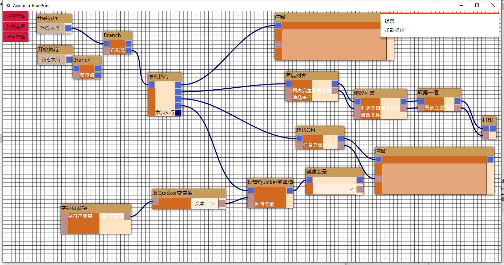
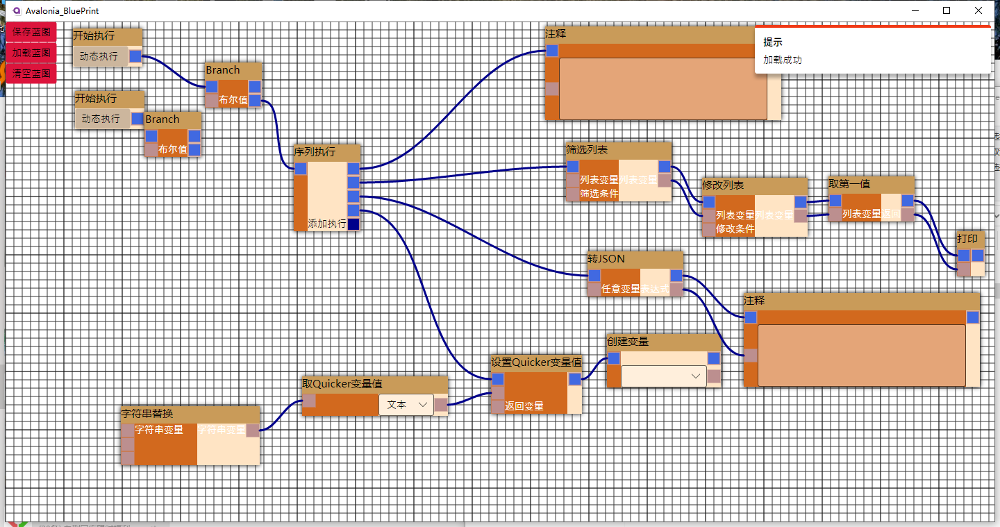

# Avalonia_BluePrint

可视化节点编辑器

###代办  
- [x] 三态折叠 √  
- [x] 滚轮缩放 √
- [x] 序列化反序列化 √
- [x] 右键菜单 √
- [x] 支持aot √
- [ ] 鼠标拖动蓝图  
- [ ] 蚂蚁线  
- [ ] 多选+操作  
- [ ] 电路线  
- [ ] 划块注释  
- [ ] 划块合并  
- [ ] ui主题  

## 编译 

> 此库是使用 [Avalonia](https://github.com/AvaloniaUI/Avalonia) 开发

 
## 操作
> #鼠标滚轮缩放蓝图

## 介绍
> 基于[Avalonia](https://github.com/AvaloniaUI/Avalonia) 框架开发的一款类似于蓝图的组件 

>> 先放几张图

> 相比大多数开源的可视化节点编辑器组件，此控件及其完善，可以开箱即用，架构灵活支持任意的项目需求来自由定制

> 支持实时预览执行节点，也支持动态生成代码，也可以做脑图之类的工具，自由定制，欢迎使用
